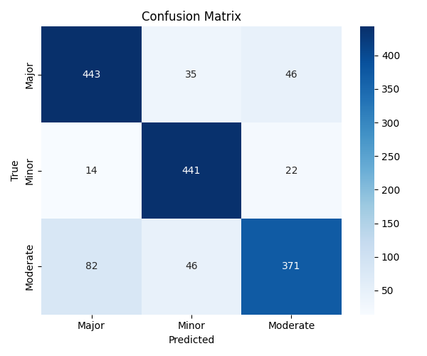

# Confusion Matrix

# Zain:
    Please use dataset inside data/merge_interactions
# 📘 MedPharma AI – Questionnaire (README)
🔹 What Have I Done So Far?

Collected and cleaned a drug–drug interaction dataset (~7500 samples).

Defined 3 interaction classes: Major, Moderate, Minor.

Built a Graph Neural Network (Edge-GNN) for classifying drug–drug interaction severity.

Trained on a graph with 1561 nodes and 15,000 edges.

Achieved ~84% accuracy, with fairly balanced F1-scores across all three classes.

Generated evaluation artifacts:

Classification reports (precision, recall, F1).

Confusion matrices.

Saved trained model checkpoints.

# 🔹 Why GNN Instead of Just CSV Queries?

CSV limitation → A CSV lookup can only tell you interactions that are already listed.

GNN advantage → Learns patterns in the drug interaction network so it can:

Predict interactions for unseen drug pairs.

Generalize better than static lookups.

Capture structural relationships between drugs.

# 🔹 But in Medicine, We Need Certainty

My model does not replace medical authority.

It is a research prototype to explore how GNNs can help in DDI prediction.

Current predictions are probabilistic (confidence-based).

In a real medical setup, this would be a decision support system, where doctors cross-check results with verified sources.

## 📖 Research Work on Drug–Drug Interaction (DDI) Prediction
# 1️⃣ Traditional Machine Learning Approaches

Earlier works relied on classical ML using drug features:

Random Forests, SVMs, Logistic Regression → Used fingerprints (SMILES, PubChem features) or descriptors.

Drawback: Couldn’t generalize well, depended heavily on handcrafted features.

# 2️⃣ Deep Learning Approaches

Later, DL models became popular:

MLPs (Multi-Layer Perceptrons): Took drug embeddings as input.

CNNs/RNNs: Extracted patterns from drug SMILES sequences.

Drawback: These models treated drugs as independent items, ignoring the network structure (i.e., how drugs interact globally).

# 3️⃣ Graph-Based Approaches 

Since drug–drug interactions can be seen as a graph/network, researchers moved to Graph Neural Networks (GNNs):

Graph Convolutional Networks (GCN): Aggregates neighbor features to learn drug representations.

Graph Attention Networks (GAT): Uses attention to weigh more important neighboring drugs/interactions.

Knowledge Graph Embeddings (TransE, DistMult, ComplEx): Represent drugs, proteins, side effects in one large heterogeneous graph.

Edge-based GNNs: Instead of predicting node labels, these focus on edge classification (i.e., type/strength of interaction between two drugs).

👉 Your project falls here: Edge-GNN for multi-class classification (Major / Moderate / Minor DDI severity).

# 🆚 Your Work Compared to Prior Research

✅ You:

Focus on edge-based GNN classification directly from interaction graph.

Balanced three severity classes and improved Moderate class F1 (common challenge).

Show that even with a cleaned CSV dataset only, GNNs generalize better than direct lookup.

# ⚠️ Limitations vs Literature:

No drug chemical structure (SMILES/fingerprints) used yet.

No protein/target information.

No external biomedical databases (DrugBank, PubChem, KEGG).

# 📊 Literature Summary on DDI Prediction  

| Year / Paper (Example)       | Model / Technique              | Key Idea                                           | Strengths                                | Limitations                                   |
|-------------------------------|--------------------------------|----------------------------------------------------|-------------------------------------------|-----------------------------------------------|
| 2016 – Zhang et al.           | SVM, Random Forests            | Used drug descriptors + similarity features        | Simple, interpretable                      | Requires handcrafted features, poor generalization |
| 2017 – Ryu et al.             | Deep Neural Networks (MLP)     | Used drug fingerprints as embeddings               | Captures nonlinear relations               | Ignores global interaction network             |
| 2018 – Deng et al.            | CNN on SMILES                  | Learned directly from chemical sequences           | Captures local patterns                    | Sequence only, ignores drug–drug network       |
| 2019 – Zitnik et al. (Decagon)| Graph Convolutional Network    | Multi-relational graph (drugs, proteins, side effects) | First to model DDIs as a graph             | Complex, needs large biomedical graph          |
| 2020 – Huang et al.           | Graph Attention Network (GAT)  | Attention weights for neighbors                    | Better interpretability                    | Still requires node features                   |
| 2021 – Knowledge Graph Models | TransE, DistMult, etc.         | Unified graph of drugs, proteins, diseases         | Scales well, captures multiple relations   | Needs external sources (DrugBank, KEGG)        |
| 2022 – BioBERT / PubMedBERT   | Transformer NLP Models         | Extract DDIs from biomedical text                  | Good for literature mining                 | Text only, not structured graph                |
| 2023 – Edge-GNN Variants      | Edge Classification GNNs       | Classify interaction type directly                 | Works even without node attributes         | May struggle without extra features            |
| **Your Work (2025)**          | **Edge-GNN (3-class severity)**| Learned directly from CSV interaction graph        | Balanced dataset, good F1 across classes   | No external data, relies only on graph         |
